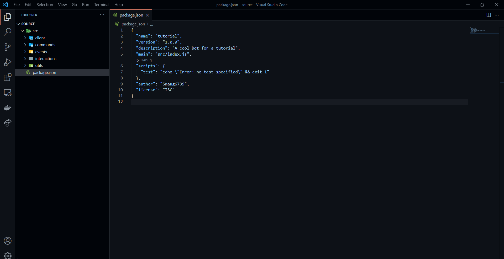

# Créer un bot discord 02/?? - Structure du projet et modules

Bienvenue dans ce nouveau chapitre sur la structure de notre projet et l'installation des modules.

Si vous n'avez pas vu le chapitre précédent sur la création du bot vous devriez le lire.

## Structure du projet

Nous allons commencer par créer un dossier qui contiendra l'ensemble du code de notre bot. Une fois le dossier crée nous pouvons ouvrir notre IDE a l'intérieur de ce dossier.
Si vous utilisez Visual Studio Code vous pouvez ouvrir le dossier avec le raccourci clavier `Ctrl K Ctrl O` ou bien en faisant Fichier => Ouvrir un dossier.

### Initialisation de npm

Une fois dans notre projet nous allons commencer par initialiser npm. Npm signifie Node Package Manager. Cette util en ligne de commande va nous permettre de télécharger des modules et de les installer. Pour initialiser npm il suffit de faire `npm init` dans un terminal (Terminal => Nouveau terminal ou `Ctrl + Shift + ù` ).
Ensuite on réponds aux différentes questions posées. Le résultat devrait etre la création d'un fichié `package.json` qui contient les informations nécessaires à l'installation de notre projet.

Pour ma part le fichier ressemble a ceci:

```json
{
  "name": "tutorial",
  "version": "1.0.0",
  "description": "A cool bot for a tutorial",
  "main": "src/index.js",
  "scripts": {
    "test": "echo \"Error: no test specified\" && exit 1"
  },
  "author": "Smaug6739",
  "license": "ISC"
}
```

### Création des dossiers

Bien qu'il soit possible de faire un bot dans un seul fichier ce n'est pas vraiment recommandé. En effet cela peut être très lourd à gérer et difficile à maintenir. Ainci nous allons découper le code source de notre bot en plusieurs dossiers et fichiers. Nous allons créer un dossier `src` qui contiendra tout le code du bot. Une fois dans ce dossier nous allons créer les sous dossiers suivants :

- `client` Qui contiendra le code du client
- `commands` Qui contiendra les commandes du bot
- `events` Qui contiendra les évènements du bot
- `interactions` Qui contiendra les interactions du bot (boutons, select-menus, etc...)
- `utils` Qui contiendra les fonctions utiles au bot

Si vous n'avez pas tous compris la vue suivante devrait vous éclairer:



### Création des fichiers

Nous allons commencer par créer quelques fichiers dans le dossier `src`.

- `index.js` dans le dossier `src` Le fichier principal du bot, nous lancerons notre bot depuis ce fichier.

- `client.js` dans le dossier `client`. Ce fichier contiendra le code du client.

- `config.js` dans le dossier `src`. Ce fichier contiendra les informations de configuration du bot.

### Fichier de configuration

Vous vous souvenez nous avions parlé du token dans le chapitre précédent ? C'est ici que nous allons stocker ce token. Pour cela retournez sur [discord.dev](https://discord.com/developers/applications) et copiez le token de votre application. Une fois le token copié vous pouvez le coller dans le fichier `config.js` en remplacant `VOTRE_TOKEN` par le token que vous avez copié.

```js
module.exports = {
  // Le token de notre bot (https://discord.dev)
  token: "VOTRE_TOKEN",
};
```

## Installation des modules

Pour notre bot nous allons utiliser des modules pour nous simplifier la tache, en effet la création d'un bot sans module est très compliquée, il faut gérer un websocket, des requetes http, le cache, le rate-limite etc. Heureusement il existe des librairies très bien faites qui nous simplifieront la tache. Nous allons donc installer discord.js et Sheweny. Discord.js permettra de faire toutes les intéractions avec l'api de discord. Et Sheweny vous simplifira l'utilisation de discord.js, Sheweny va s'occuper de charger vos différents fichier et de gérer les évènements important, les commandes, événements etc. Pour installer discord.js et Sheweny il suffit de faire `npm install discord.js sheweny` dans un terminal.

## Conclusion

Dans ce chapitre nous avons vu :

- Comment créer une structure propre pour notre bot
- Comment créer notre fichier de config
- Comment initialiser `npm`
- Enfin comment installer les modules nécessaires
