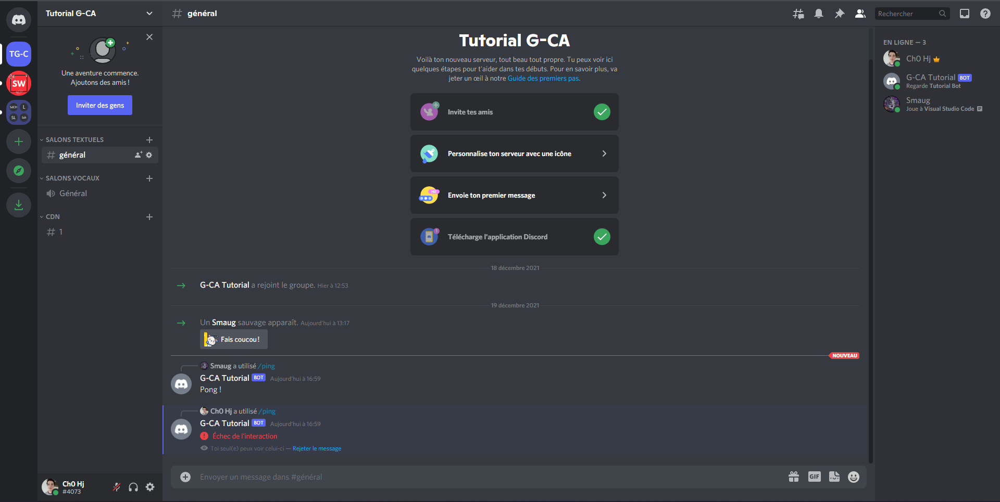

# Créer un bot discord 06/?? - Création de notre première commande d'interaction

Bienvenue dans ce nouveau chapitre dans lequel nous allons créer notre première slash-command.

_Ce chapitre fait parti d'une série de tutoriels. Bien qu'il soit possible de la suivre sans avoir lu les chapitres précédents, il est conseillé de les lire avant de commencer ce chapitre._

## Préparation

Pour ma part je vais appeler ce fichier `slash-ping.js`.

## Code minimale d'une commande

Nous allons voir ici le code minimale requis pour que notre commande fonctionne :

```js
const { Command } = require("sheweny");

module.exports = class PingCommand extends Command {
  constructor(client) {
    super(client, {
      name: "ping",
      type: "SLASH_COMMAND",
      description: "Ping the bot",
      category: "Misc",
    });
  }
  execute(interaction) {
    interaction.reply({ content: "Pong !" });
  }
};
```

On va décomposer le code suivant.

### Importation et instanciation de la classe Command

Tout d'abord, on importe la classe `Command` de la librairie Sheweny. Cette classe contient tout ce qui est nécéssaire à la création de n'importe quelle commande.
On utilise le mot clé `extends` pour étendre la classe et pouvoir définir le code de nos fonctions.

### Options de la commande

Nous allons donc maintenant parler de l'objet suivant :

```js
{
  name: "ping",
  type: "SLASH_COMMAND",
  description: "Ping the bot",
  category: "Misc",
}
```

Cet objet contient toutes les options de la commande, en premier le nom de la commande, cette clé est obligatoire. Ensuite il y a le type, les valeurs possibles sont "SLASH_COMMAND", "MESSAGE_COMMAND", "CONTEXT_MENU_USER" et "CONTEXT_MENU_MESSAGE". Le type nous permet donc de créer différents types de commandes. Le type "SLASH_COMMAND" est une commande qui est appelée avec un slash. Le type "MESSAGE_COMMAND" est une commande qui est appelée avec un message. Le type "CONTEXT_MENU_USER" est une commande qui est appelée avec un menu contextuel d'un utilisateur. Le type "CONTEXT_MENU_MESSAGE" est une commande qui est appelée avec un menu contextuel d'un message. Nous aurons la possibilité de reparler des types et de détailler l'utilisation de chacun d'eux.
Ensuite on a la description de la commande, cette clé est obligatoire. Enfin on a la catégorie, cette clé est quant à elle, optionnelle.
Il existe d'autres options qui seront détaillées plus tard mais vous pouvez les retrouver dans la documentation de Sheweny : [CommandOptions](https://sheweny.js.org/doc/typedef/CommandOptions.html)

### Fonction execute

On retrouve une fonction `execute()`, cette fonction contiendra l'ensemble du code de notre commande, ici nous avons simplement mis une réponse à l'utilisateur.
Pour les slash-commands la fonction execute aura toujours un paramètre de type [CommandInteraction](https://discord.js.org/#/docs/main/stable/class/CommandInteraction)
On voit donc sur la documentation de discord.js que nous avons accès à la fonction `reply()` ce qui nous permet de répondre à l'utilisateur.
Notez que si nous ne répondons pas à l'utilisateur, nous verrons un message d'erreur apparaître sur discord au bout de 3 secondes :



Il existe d'autres fonctions que `execute()` mais nous aurons l'occasion d'en reparler plus tard.

## Éditer une réponse

Pour améliorer notre commande ping nous allons ajouter le temps de réponse du bot (qui sera en fait le temps qu'il met à envoyer un message).

Pour cela, nous allons créer une variable au début avec le timestamp de départ puis nous allons créer une autre variable avec le timestamp au moment ou le message a été envoyé.
Ensuite, il suffira de faire une différence entre les deux variables pour connaître le temps de réponse du bot.

```js
const start = Date.now();
interaction.reply({ content: "Pong !" }).then(() => {
  const end = Date.now();
  const time = end - start;
  interaction.editReply({ content: `Pong : ${time}ms` });
});
```

Ici la fonction `Date.now()` nous permet de récupérer le timestamp actuel. Un timestamp correspond au nombre de millisecondes depuis le 1er janvier 1970.

## Code source final

Vous pouvez retrouver le code complet du bot sur [github](https://github.com/Sheweny/Tutorial)

_slash-ping.js_

```js
const { Command } = require("sheweny");

module.exports = class PingCommand extends Command {
  constructor(client) {
    super(client, {
      name: "ping",
      type: "SLASH_COMMAND",
      description: "Ping the bot",
      category: "Misc",
    });
  }
  execute(interaction) {
    const start = Date.now();
    interaction.reply({ content: "Pong !" }).then(() => {
      const end = Date.now();
      const time = end - start;
      interaction.editReply({ content: `Pong : ${time}ms` });
    });
  }
};
```

## Conclusion

Dans ce chapitre sur notre première commande vous avez appris :

- À créer une slash-command
- À définir les options de base de la commande
- À définir la fonction execute
- À répondre et modifier la réponse de la commande

Si vous avez des questions n'hésitez pas à me contacter sur le [serveur support](https://discord.gg/euCF8bp4cN) ou via des issues sur le repo.

Passez un bon moment en codant avec Sheweny !
